# Genzeb User Guide

Genzeb is a local-first desktop app for tracking personal expenses. Your data lives entirely on your own machine as plain CSV files — no accounts, no cloud sync, no subscription required.

All edits are recorded in an append-only ledger, so nothing is ever deleted and you have a full audit trail of every change.

### Three ways to use it

**1. Desktop UI**
The full graphical interface for importing statements, browsing transactions, managing receipts, and reviewing your finances visually.

**2. Ask AI (built-in)**
A conversational panel inside the app. Ask plain-English questions about your transactions — "How much did I spend on dining last month?" — and get answers powered by your own Anthropic or OpenAI API key. Your data never leaves your machine except for that specific query.

**3. MCP agent (Claude Code, Claude Desktop, ChatGPT Desktop, or any MCP-compatible AI tool)**
Genzeb exposes an MCP server that AI agents can connect to directly. This means you can query your finances, categorize transactions, import statements, and link receipts without opening the app at all.

```
# Example: ask Claude Code or ChatGPT Desktop about your finances
> How much did I spend on subscriptions this year?
> Categorize all transactions from Amazon as Shopping
> Show me unlinked receipts from last month
```

The MCP server and the UI read and write the same data folder, so changes made by an agent appear instantly in the app and vice versa. See `docs/mcp-setup.md` for connection instructions.

---

## Table of Contents

1. [Getting Started](#1-getting-started)
2. [Dashboard](#2-dashboard)
3. [Importing Data](#3-importing-data)
4. [Transactions](#4-transactions)
5. [Receipts](#5-receipts)
6. [Item Explorer](#6-item-explorer)
7. [Reconcile](#7-reconcile--link-receipts-to-transactions)
8. [Ask AI](#8-ask-ai)
9. [Settings](#9-settings)

---

## 1. Getting Started

### Installation

Download the installer for your platform from the releases page and run it. Genzeb is available for macOS, Windows, and Linux.

### Choosing a data folder

On first launch, Genzeb will open the **Settings** page and prompt you to pick a **data folder**. This is where all your transaction data, receipts, and edit history will be stored. Choose any folder you like — for example `~/Documents/Genzeb`.

> **Tip:** Back up your data folder with any tool you already use (Time Machine, rsync, Dropbox, etc.). Because everything is plain CSV, you can inspect or open the files in a spreadsheet at any time.

Once a data folder is set, Genzeb creates three sub-folders inside it:

| Folder | Contents |
|--------|----------|
| `Data/` | `ledger.csv`, `changes.csv`, `links.csv` — your financial records |
| `Inbox/` | Drop receipt images here to import them automatically |
| `Exports/` | CSV exports generated by Ask AI |

---

## 2. Dashboard

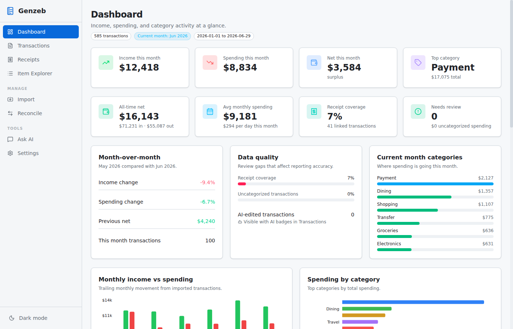

The Dashboard gives you a real-time view of your finances across two rows of KPI cards and several detail panels.

### KPI cards — row 1 (current month)

| Card | What it shows |
|------|---------------|
| **Income this month** | Total deposits / income for the current calendar month |
| **Spending this month** | Total outflows for the current month |
| **Net this month** | Income minus spending — labelled "surplus" or "deficit" |
| **Top category** | The category with the highest total spending overall |

### KPI cards — row 2 (all-time & data quality)

| Card | What it shows |
|------|---------------|
| **All-time net** | Cumulative income minus spending across all imported data |
| **Avg monthly spending** | Average outflow per month, with a per-day figure for this month |
| **Receipt coverage** | Percentage of transactions that have a linked receipt |
| **Needs review** | Count of uncategorized transactions and the dollar amount they represent |

### Detail panels

- **Month-over-month** — income change %, spending change %, previous month net, and transaction count for the current month compared with the prior month
- **Data quality** — progress bars for receipt coverage and uncategorized transaction percentage, plus a count of AI-edited transactions
- **Current month categories** — horizontal progress bars for the top 6 spending categories this month

### Charts

- **Monthly income vs spending** — grouped bar chart of income (green) and spending (red) by month across your imported history
- **Spending by category** — horizontal bar chart of your top 10 categories by all-time total

Use the Dashboard as a quick health-check. Amber "Needs review" or low receipt-coverage bars are a prompt to head to Transactions or Reconcile.

---

## 3. Importing Data

### Importing Bank/Card Statements

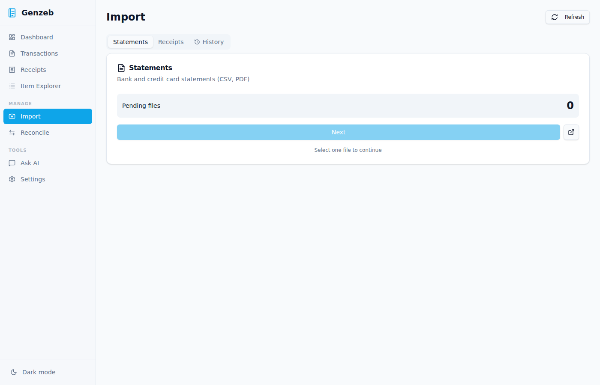

1. Go to **Import** in the sidebar.
2. Make sure the **Statements** tab is selected.
3. Click **Choose file** and select a CSV exported from your bank or card issuer.
4. Genzeb auto-detects the date, amount, and description columns. Confirm the column mapping in the preview.
5. Click **Import** to add the transactions to your ledger.

Genzeb deduplicates imports — re-importing the same file is safe and will not create duplicate rows.

**Supported CSV formats:** Most bank and credit card exports work out of the box. If column detection fails, you can manually assign columns in the mapping step.

### Importing Receipts

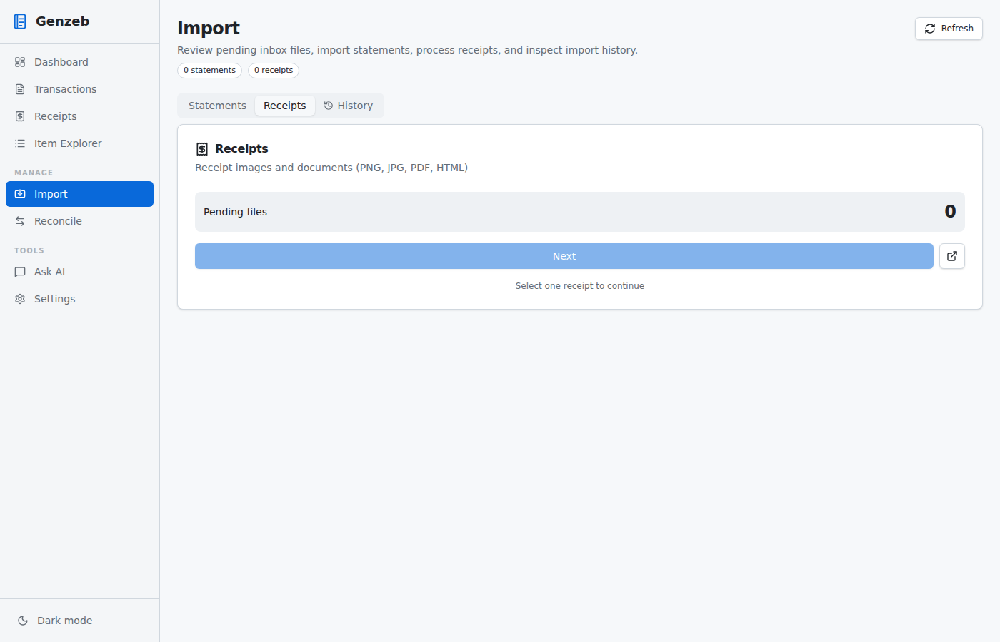

1. Switch to the **Receipts** tab.
2. Drag and drop receipt images (JPG, PNG, PDF) onto the drop zone, or click to browse.
3. If an Anthropic or OpenAI API key is set in Settings, Genzeb will automatically run OCR to extract the merchant, total, and individual line items from each receipt.
4. Processed receipts appear in the **Receipts** page.

**Shortcut:** Drop receipt files directly into the `Inbox/` sub-folder inside your data folder — Genzeb will pick them up automatically.

### Import History

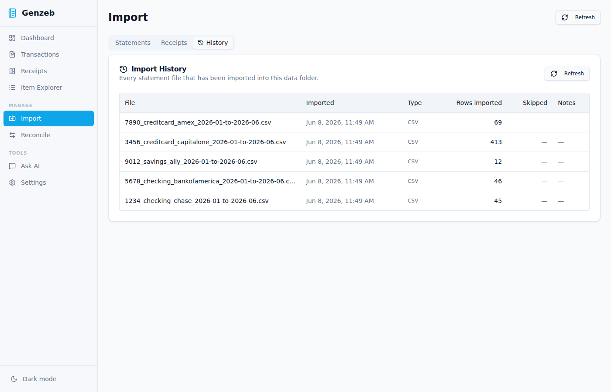

The **History** tab shows a log of every import: when it ran, how many rows were added, and the source file name.

---

## 4. Transactions


The Transactions page is a full-featured table of every transaction from your imported statements.

### Filtering

Click the **Filters** button in the toolbar to expand the filter panel. Available filters:

- **Search** — full-text search across description and merchant
- **Account** — limit to a specific bank/card account
- **Date range** — start and end date
- **Amount range** — minimum and/or maximum amount
- **Merchant contains** — substring match on the merchant field
- **Has receipt** — show only transactions with or without a linked receipt
- **Uncategorized only** — show only transactions with no category assigned

The toolbar badge shows how many filters are currently active.

### Sorting and columns

Click any column header to sort. Use the **Columns** button to show or hide individual columns — for example, you can hide **Subcategory** and **Notes** when you don't need them.

### Footer totals

The footer shows the **count** and **total amount** of the transactions currently visible under the active filters.

### Editing a transaction

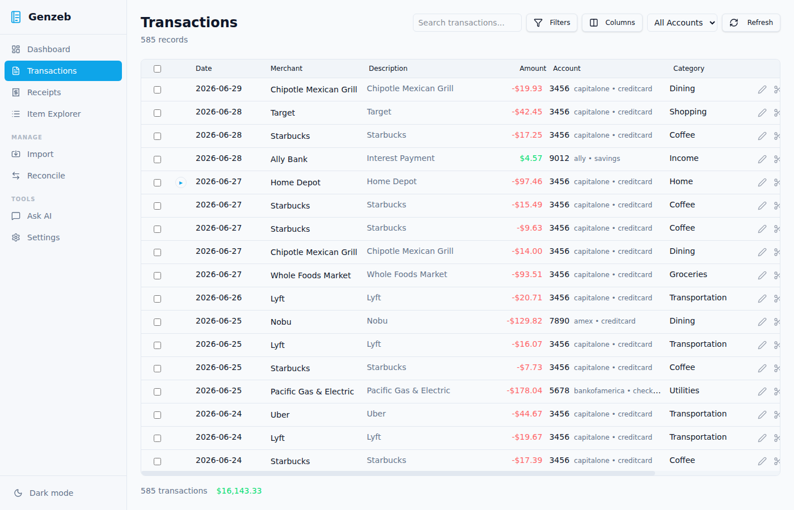

Click any row to expand it. From the expanded view you can:

- **Change the category and subcategory**
- **Edit the merchant name**
- **Add or edit notes**
- **View change history** — every edit ever made to this row, with timestamps
- **View linked receipt** — if a receipt is linked, it appears inline with its line items
- **Split the transaction** — see below

All edits are written to `changes.csv` as append-only entries. The original imported data is never modified.

### Bulk editing

Select multiple rows using the checkbox column. The **Edit selected** toolbar appears automatically with options to set a category or merchant across all selected rows at once.

### Splitting a transaction

If a single bank charge covers multiple purposes (e.g. a grocery run that includes both food and household items):

1. Expand the row and click **Split**.
2. Add split rows — each with an amount and category.
3. The amounts must sum to the original total.
4. Confirm to save; the original row is replaced by the split children in the table.

---

## 5. Receipts

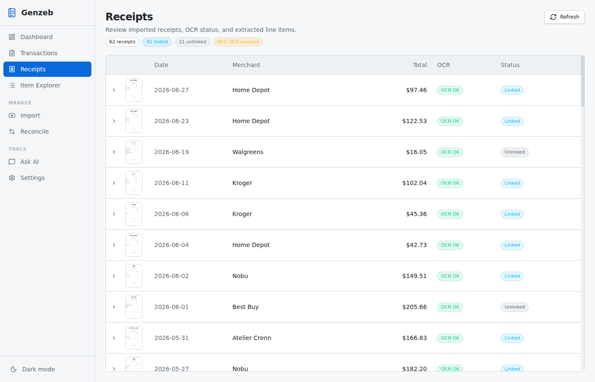

The Receipts page shows all ingested receipts as a thumbnail grid. Each receipt has a status badge:

| Badge | Meaning |
|-------|---------|
| **OK** | OCR completed successfully |
| **Pending** | OCR is queued or running |
| **Failed** | OCR could not extract data — try re-running OCR |
| **Linked** | The receipt has been matched to a transaction |

### Viewing a receipt

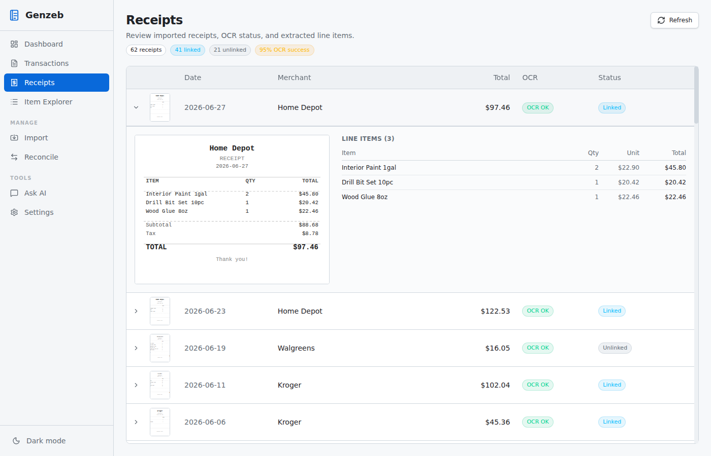

Click any thumbnail to open the detail view:

- The **original receipt image**
- Extracted **line items** from OCR (merchant, date, totals, individual items)
- The **linked transaction**, if reconciled
- A **Re-run OCR** button to retry extraction

---

## 6. Item Explorer

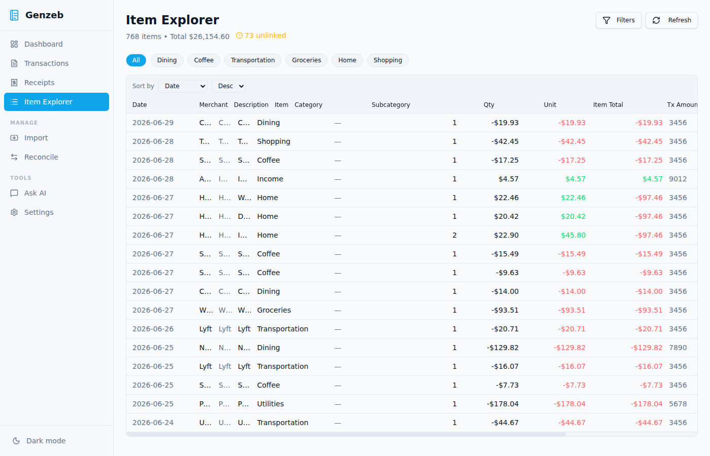

The Item Explorer lets you browse individual **line items** extracted from receipts — useful when you want to track spending at the product level rather than the transaction level.

Use the **Linked / Unlinked filter** to find receipt line items that have not yet been associated with a transaction. Unlinked items show an amber **Unlinked** badge as a reminder to reconcile them.

---

## 7. Reconcile — Link Receipts to Transactions

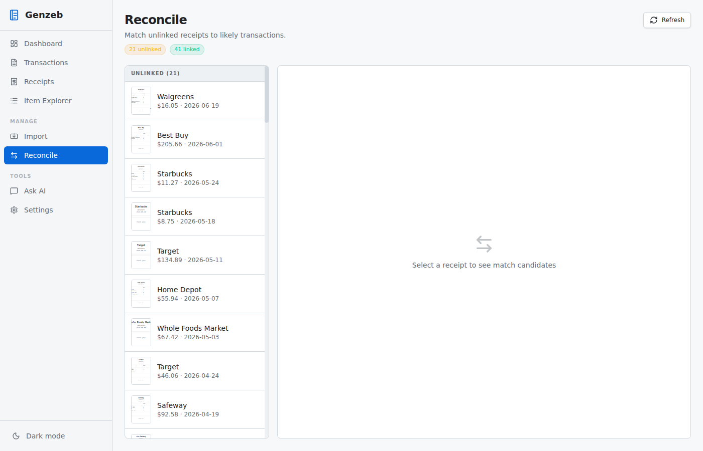

Reconcile matches receipts to bank/card transactions so you have both the official charge and the itemised receipt in one place.

### How it works

1. Genzeb automatically scores candidate matches based on date proximity and amount similarity.
2. High-confidence matches appear at the top of the list.
3. Review each suggestion and click **Link** to confirm, or **Skip** to dismiss.
4. You can also **manually link** any receipt to any transaction using the search fields.

Confirmed links are stored in `links.csv`. To remove a link, click **Unlink** from the Reconcile page or from the expanded transaction row.

---

## 8. Ask AI

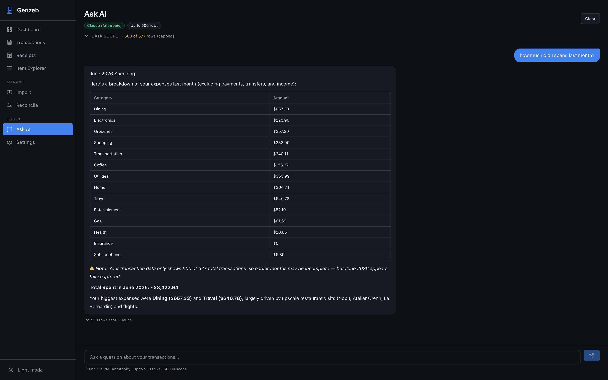

Ask AI lets you query your transaction data in plain English. It requires an API key (Anthropic or OpenAI) set in **Settings**.

### Examples

- "How much did I spend on groceries last month?"
- "What was my biggest expense category in Q1?"
- "List all transactions over $200 in the last 90 days"
- "Compare my spending this month to last month"

### How it works

Genzeb exports a filtered subset of your transactions as CSV and sends it to the LLM along with your question. Each question is independent — there is no conversation history between turns. The provider is auto-selected: Anthropic if an Anthropic key is set, otherwise OpenAI.

Responses are rendered as formatted markdown (tables, bold numbers, bullet lists). A **View data sent** disclosure shows exactly which rows were sent to the API.

> **Privacy note:** Your transaction data leaves your device only for this specific query, and only to the provider whose API key you supply. No data is sent by Genzeb itself.

---

## 9. Settings

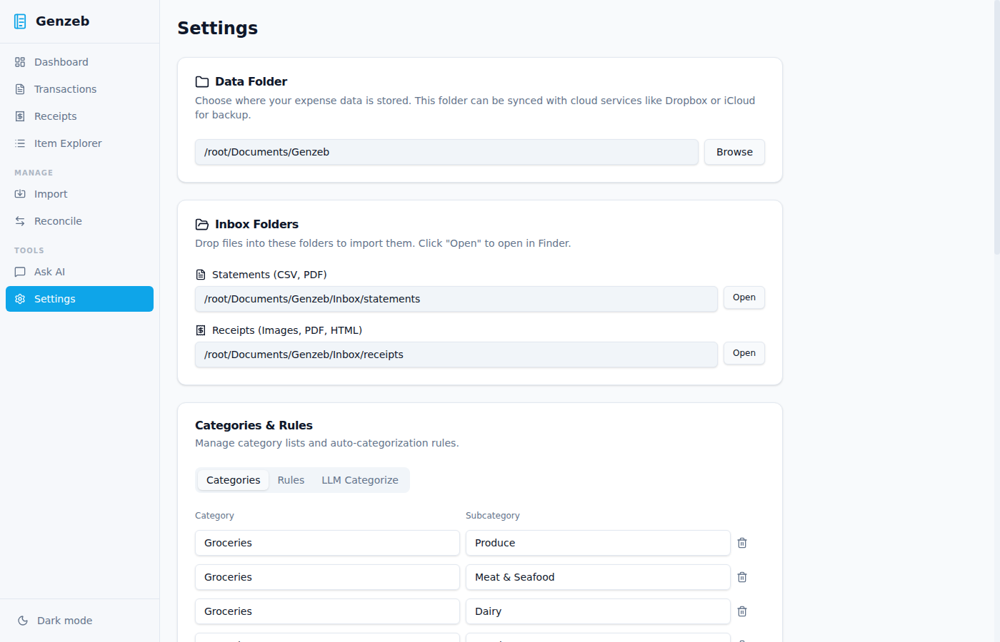

### Data folder

Shows the current data folder path. Click the folder icon to choose a different location. Changing this setting takes effect immediately on the next data refresh.

### API Keys

| Key | Used for |
|-----|----------|
| **OpenAI API Key** | Ask AI queries, bulk categorization |
| **Anthropic API Key** | Receipt OCR, Ask AI queries, bulk categorization |

Keys are stored locally in the settings file on your machine and are never uploaded by Genzeb.

Click **Save** after entering or changing keys — the button activates when you have unsaved changes.

### Categories & Rules

The **Categories** tab lets you manage your category list. Add, edit, or reorder categories that appear in transaction editing and filtering.

The **Rules** tab lets you define auto-categorization rules. Each rule has a **pattern** (substring match on the transaction description or merchant) and a **category** to assign. Rules are applied in order — the first match wins.

### LLM bulk categorization

With an API key configured, the **LLM Categorize** tab lets you run AI categorization across all uncategorized transactions at once. Review the suggestions before confirming.

---

## Keyboard shortcuts

| Shortcut | Action |
|----------|--------|
| `Ctrl/Cmd + R` | Reload data from disk |
| `Escape` | Close expanded row or modal |

---

## Data layout

All data lives inside your chosen data folder:

```
~/Documents/Genzeb/
  Data/
    ledger.csv        ← raw imported transactions (do not edit directly)
    changes.csv       ← your edits, append-only
    transactions.csv  ← materialised view rebuilt from ledger + changes
    links.csv         ← receipt-to-transaction links
  Inbox/              ← drop receipt images here for auto-import
  Exports/            ← Ask AI CSV exports land here
```

Never edit `ledger.csv` or `transactions.csv` directly — use the app so that all changes are recorded in `changes.csv` and the full audit trail is preserved.
