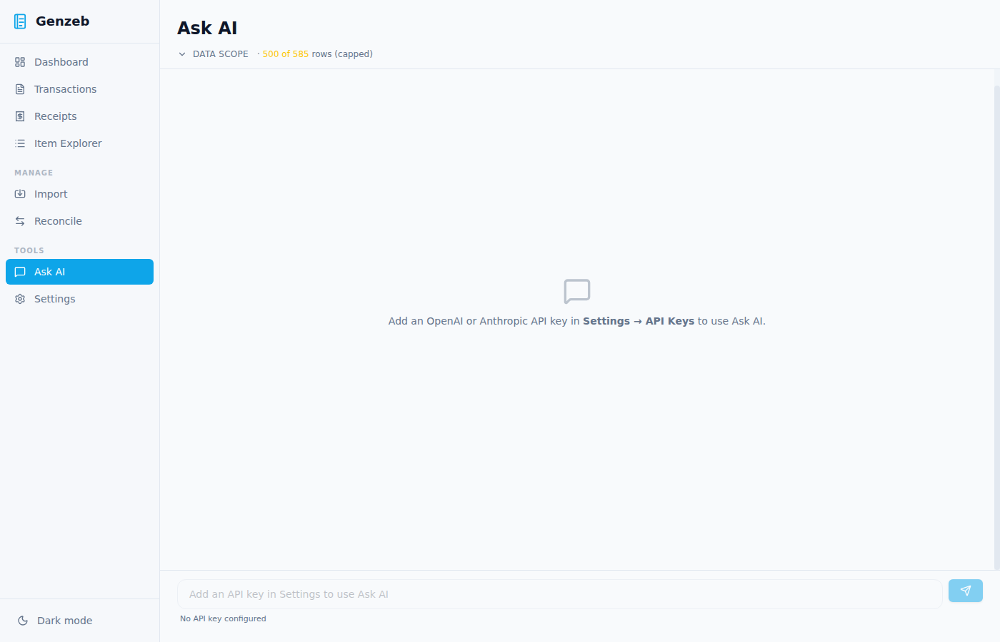

# Genzeb User Guide

Genzeb is a local-first desktop app for tracking personal expenses. Your data lives entirely on your own machine as plain CSV files — no accounts, no cloud sync, no subscription required.

---

## Table of Contents

1. [Getting Started](#1-getting-started)
2. [Dashboard](#2-dashboard)
3. [Importing Data](#3-importing-data)
   - [Importing Bank/Card Statements](#importing-bankcards-statements)
   - [Importing Receipts](#importing-receipts)
4. [Transactions](#4-transactions)
5. [Receipts](#5-receipts)
6. [Item Explorer](#6-item-explorer)
7. [Reconcile — Link Receipts to Transactions](#7-reconcile--link-receipts-to-transactions)
8. [Ask AI](#8-ask-ai)
9. [Settings](#9-settings)

---

## 1. Getting Started

### Installation

Download the installer for your platform from the releases page and run it. Genzeb is available for macOS, Windows, and Linux.

### Choosing a data folder

On first launch, Genzeb will prompt you to pick a **data folder**. This is where all your transaction data, receipts, and edit history will be stored. Choose any folder you like — for example `~/Documents/Genzeb`.

> **Tip:** Back up your data folder with any tool you already use (Time Machine, rsync, Dropbox, etc.). Because everything is plain CSV, you can open the files in a spreadsheet at any time.

Once a data folder is set, Genzeb creates three sub-folders inside it:

| Folder | Contents |
|--------|----------|
| `Data/` | `ledger.csv`, `changes.csv`, `links.csv` — your financial records |
| `Inbox/` | Drop receipt images here to import them automatically |
| `Exports/` | CSV exports generated by Ask AI |

---

## 2. Dashboard


The Dashboard gives you a high-level view of your finances for the current period:

- **Monthly spending chart** — bar chart of total spending by month
- **Category breakdown** — pie or bar chart showing where money goes
- **Income vs Expense summary** — totals at a glance

Use the Dashboard as a quick health-check. For drilling into individual transactions, head to the **Transactions** page.

---

## 3. Importing Data

### Importing Bank/Card Statements


1. Go to **Import** in the sidebar.
2. Make sure the **Statements** tab is selected.
3. Click **Choose file** and select a CSV exported from your bank or card issuer.
4. Genzeb will auto-detect the date, amount, and description columns. Confirm the mapping looks correct in the preview.
5. Click **Import** to add the transactions to your ledger.

Genzeb deduplicates imports — re-importing the same file is safe and will not create duplicate rows.

**Supported CSV formats:** Most bank and credit card exports work out of the box. If column detection fails, you can manually assign columns in the mapping step.

### Importing Receipts


1. Switch to the **Receipts** tab.
2. Drag and drop receipt images (JPG, PNG, PDF) onto the drop zone, or click to browse.
3. If an Anthropic or OpenAI API key is configured in Settings, Genzeb will automatically run OCR to extract the merchant, total, and individual line items from each receipt.
4. Processed receipts appear in the **Receipts** page.

**Shortcut:** You can also drop receipt files directly into the `Inbox/` sub-folder inside your data folder — Genzeb will pick them up automatically.

### Import History


The **History** tab shows a log of every import: when it ran, how many rows were added, and the source file name.

---

## 4. Transactions


The Transactions page is where you spend most of your time. It shows all transactions from your imported statements in a sortable, filterable table.

### Filtering and sorting

- Use the **search bar** to filter by description or merchant name.
- Click any **column header** to sort by that column.
- Use the **date range picker** and **category filter** to narrow the view.

### Editing a transaction


Click any row to expand it. From the expanded view you can:

- **Change the category** — pick from your category list or type a new one
- **Edit the description** — correct merchant names or add notes
- **Edit the amount** — fix errors from the original import
- **View change history** — see every edit ever made to this transaction (full audit trail)
- **View linked receipt** — if a receipt has been linked, it appears inline

All edits are written to `changes.csv` as append-only entries. The original imported data is never modified.

### Bulk editing

Select multiple rows with the checkbox column, then use the **Edit selected** toolbar to apply a category or description change to all selected rows at once.

### Splitting a transaction

If a single transaction covers multiple purposes (e.g. a grocery run that includes both food and household items), click **Split** in the expanded row. Enter the amounts and categories for each portion; they must sum to the original total.

---

## 5. Receipts


The Receipts page shows all ingested receipts as a thumbnail grid. Each receipt has a status badge:

| Badge | Meaning |
|-------|---------|
| **OK** | OCR completed successfully |
| **Pending** | OCR is queued or running |
| **Failed** | OCR could not extract data (image quality issue) |
| **Linked** | The receipt has been matched to a transaction |

### Viewing a receipt


Click any receipt thumbnail to open the detail view, which shows:

- The **original receipt image**
- Extracted **line items** (if OCR ran)
- The **linked transaction** (if reconciled)
- A **Re-run OCR** button to retry extraction with a better prompt

---

## 6. Item Explorer


The Item Explorer lets you browse individual **line items** extracted from receipts — useful when you need to track spending at the product level rather than the transaction level.

Use the **Linked / Unlinked filter** to find receipt items that have not yet been matched to a transaction.

---

## 7. Reconcile — Link Receipts to Transactions


Reconcile matches receipts to bank/card transactions so you have both the official charge and the itemized receipt in one place.

### How it works

1. Genzeb automatically scores candidate matches based on date proximity and amount similarity.
2. High-confidence matches are shown at the top.
3. Review each suggestion and click **Link** to confirm, or **Skip** to dismiss.
4. You can also **manually link** any receipt to any transaction using the search fields.

Confirmed links are stored in `links.csv`. To remove a link, click **Unlink** in either the Reconcile page or the transaction detail view.

---

## 8. Ask AI



Ask AI lets you query your transaction data in plain English. It requires an API key (Anthropic or OpenAI) set in **Settings**.

### Examples

- "How much did I spend on groceries last month?"
- "What was my biggest expense category in Q1?"
- "List all transactions over $200 in the last 90 days"

### How it works

Genzeb exports a filtered subset of your transactions as CSV and sends it to the LLM along with your question. **Your transaction data leaves your device only for this query and only to the provider whose API key you supply.** The response is shown directly in the app.

---

## 9. Settings


### Data folder

Change which folder Genzeb reads and writes data to. Useful if you want to switch between different sets of accounts or move your data.

### API Keys

- **Anthropic API key** — used for receipt OCR and Ask AI queries via Claude
- **OpenAI API key** — alternative provider for Ask AI

Keys are stored locally in the settings file on your machine and are never uploaded by Genzeb itself.

### Categories

The category editor lets you define your custom category list. Click **Add category** to create a new one, or drag to reorder.

### Auto-categorization rules

Rules automatically assign a category to transactions whose description matches a pattern. Each rule has:

| Field | Example |
|-------|---------|
| Pattern (substring match) | `WHOLE FOODS` |
| Category | `Groceries` |

Rules are applied in order. The first matching rule wins.

### LLM bulk categorization

With an API key configured, you can click **Categorize all** to run AI categorization across all uncategorized transactions at once. Review the suggestions before accepting.

---

## Keyboard shortcuts

| Shortcut | Action |
|----------|--------|
| `Ctrl/Cmd + R` | Reload data from disk |
| `Escape` | Close expanded row / modal |

---

## Data layout

All data lives in your chosen data folder:

```
~/Documents/Genzeb/
  Data/
    ledger.csv       ← merged view of all transactions (do not edit directly)
    transactions.csv ← imported transactions (do not edit directly)
    changes.csv      ← your edits (append-only)
    links.csv        ← receipt-to-transaction links
  Inbox/             ← drop receipt images here
  Exports/           ← Ask AI exports land here
```

Because the data is plain CSV, you can inspect or back it up with any tool. Never edit `ledger.csv` or `transactions.csv` directly — use the app so that changes are recorded in `changes.csv`.
